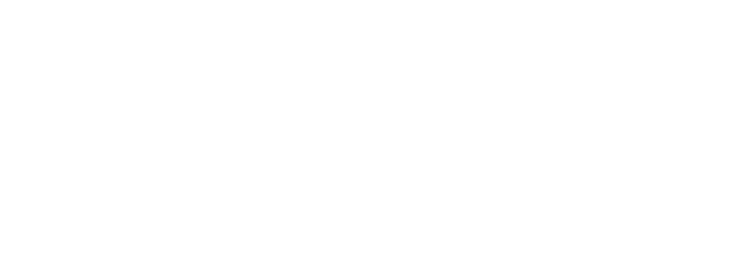

<div align="right">

</div>

# TDA LISTA/PILA/COLA

## Repositorio de Leon Acosta - 113246 - leacosta@fi.uba.ar 

- Para la compilacion y ejecucion del programa de provee un **makefile**.

  - Compilar:

    ```bash
    # compilar el programa
    make tda
    # compilar las pruebas
    make pruebas_alumno
    ```

  - Ejecutar:

    ```bash
    # correr el programa
    make ejecutar PARAMETROS="<parametros>"
    # correr con el programa valgrind
    make valgrind PARAMETROS="<parametros>"
    # correr las pruebas
    make correr_pruebas
    ```

> [!IMPORTANT]
> Los parametros que se deben pasar entre "" corresponden al nombre de un archivo con pokemones, y tres parametros extra los cuales son busqueda, nombre o id, nombre del pokemon buscado o ID del pokemon buscado. 
>
> Ejemplo: `make ejecutar PARAMETROS="./ejemplos/normal.csv buscar nombre Pikachu"` O `make ejecutar PARAMETROS="./ejemplos/normal.csv buscar id 1"`

---

##  Funcionamiento

El programa funciona recibiendo por parametro el nombre de un archivo el cual contiene datos de pokemones, se encarga de hacer las verificaciones necesarias.
Luego se encarga de leerlo linea por linea, y parseando cada linea en una estructura de _pokemon_, cada pokemon es almacenado luego en una estructura `tp1_t`.
A partir de esa estructura es que se utiliza la implementacion del **TDA Lista** por nodos simplemente enlazados.
En donde cada nodo guarda la referencia a cada pokemon de la lista.
Utilizando las primitivas del _TDA Lista_ es que podemos realizar la busqueda del elemento dentro de la misma y finalmente mostrarlo.

---

## Implementacion

Para la implementacion de los tres TDAs utilize una estructura `nodo_t` la cual se encuentra dentro del archivo `aux.h`.
Esta estructura contiene un `void* dato` para poder almacenar la referencia a un dato que se desee almacenar, y una referencia a otra estructura `nodo_t` llamado proximo.
_Nota_: el nombre de proximo en la referencia de la estructura esta pensado para que se pueda utilizar en los tres tda, ya sea que el proximo de la pila este debajo del tope, o el proximo de la cola este por detras de la cabecera. _No referencia una posicion literal en la estructura como si lo podria ser anterior o siguiente y demas_.

### Lista

Para la implementacion de lista decidi almacenar dentro de `lista_t` una variable de tipo `size_t` para guardar la cantidad total de elementos, y dos referencias a `nodo_t`.
Una para referencia el _primer nodo_ de la lista y la otra para referenciar el _ultimo nodo_ de la lista.
El almacenar esta referencia permite reducir la complejidad de ciertas operaciones detalladas posteriormente.

<div align="center">

</div>

**Crear**: esta primitiva se encarga de devolver una estructura `lista_t` almacenada en memoria dinamica.
Utiliza la funcion `calloc()` de la biblioteca estandar, y en este caso podemos decir que la _complejidad_ de esta operacion es _O(1)_ ya que aunque calloc inicializa las variables en 0, en este caso, siempre lo va a hacer para 3 elementos fijos (2 nodos en NULL y un size_t cantidad en 0).

**Verificar Vacia**: recibe una lista por parametro y retorna como bool el resultado de validar `lista->cantidad == 0`, si esta vacia devuelve true, sino devuelve false.
Ademas, devuelve false siempre que se le pase una lista NULL, osea invalida.

**Cantidad**: recibe una lista por parametro y retorna lo que almacena la variable de `lista->cantidad`. Si la lista pasada por parametro es invalida retorna 0.

<div align="center">

</div>

**Agregar al Final**: recibe una lista y un puntero `void* ` a un dato por parametro.
Esta operacion se encarga de agregar al final de la lista un nuevo nodo con el dato pasado por parametro.
Para eso, valida si el primer nodo de la lista es NULO, ya que si lo es significa que la lista esta vacia y este nuevo nodo debe ser apuntado por el primer nodo de la lista.
En otro caso se apunta el `proximo nodo` del `ultimo_nodo` de la lista al nuevo nodo, y se reasigna el __ultimo_nodo_ a su `proximo` osea el nuevo nodo.
    
- Esta operacion tiene una _complejidad temporal_ de _O(1)_ ya que la cantidad maxima de operaciones que se van a realizar son todas sentencias de declaracion de variables y asignaciones de las mismas, ademas de que lo hacen como maximo 1 vez, sin reiteraciones.
- **Dificultad Encontrada**: En un principio la implementacion de esta primitiva la realice con una complejidad _O(n)_, ya que mi estructura de `lista_t` no almacenaba la referencia al `ultimo_nodo`, sino que simplemente era el puntero al `primer_nodo` por lo que cuando queria agregar un elemento en el final de la lista tenia que ir recorriendo y avanzando entre los nodos _proximos_, lo cual resultaba en la complejidad mencionada. Sin embargo, agregar la referencia al `ultimo_nodo` me permitio reducirla la complejidad.

<div align="center">

</div>

**Insertar**: esta operacion recibe por parametro una lista, un puntero `void*` a un dato, y la `posicion` de la lista en la que se lo desea almacenar.
Para implementarlo 

<div align="center">

</div>

**Buscar Posicion**: esta primitiva recibe una lista, un puntero `void*` al elemento que se esta buscando dentro de la lista y un puntero a una funcion de `comparador` la cual es de tipo `int` y recibe dos `const void*`
Para la implementacion de esta operacion se van reocrriendo de manera iterativa los elementos de la lista y aplicandoles al dato de cada nodo el comparador pasado por parametro. Si el mismo retorna 0, quiere decir que los elementos coinciden y por lo tanto se ha encontrado el elemento.
La funcion retorna la posicion en la que se encuentra el elemento dentro de la lista.

**Buscar Elemento**: dada un lista y una posicion dentro de la misma, la funcion se encarga de buscar el elemento en dicha posicion y devolverlo.
Si la posicion es mayor a o igual a la cantidad de elementos la lista, significa que se esta intentado buscar en un indice invalido y devuelve NULL.
Lo mismo si la lista recibida por parametro es invalida.

**Iterador Interno**: esta primitiva refiere a un _"Iterador Interno"_ el cual nos permite aplicar una funcion `f`, la cual es recibida como puntero a funcion por parametro, a cada elemento de la lista.

**Destructores**:
Para la lista tenemos dos destructores, uno que libera de manera iterativa cada nodo, y finalmente libera la memoria reservada para la lista.
Y otro que ademas de estas operaciones recibe un destructor para poder liberar los elementos reservados en cada nodo.

### Iterador Externo de Lista

Para la implementacion del _TDA_ `lista_iterador`, decidi almacenar la un puntero a una estructura `lista_t` y un puntero al nodo de la corriente iteracion `nodo_actual`.

**Crear**: Esta funcion reserva memoria con la funcion estandar `malloc()` para un `lista_iterador_t` y asigna la lista pasada por parametro a la lista que apunta el iterador, y el `nodo_actual` apuntando al *primer_nodo* de la lista.

**Obtener Actual**: Esta operacion se encarga de devolver el dato almacenado dentro del nodo de la actual iteracion.

**Avanzar Siguiente**: Recibe una puntero a un iterador, y reasigna el puntero del `nodo_actual` al _proximo_ nodo del mismo. Avanzando asi la iteracion.
Si el iterador es NULL, o el `nodo_actual` de la iteracion es NULL la funcion no aplica ninguna operacion.

**Hay mas Elementos**: Retorna una variable booleana si quedan elementos por iterar dentro de la lista, lo hace verificando si el nodo actual es distinto de NULL.

**Destructor**: Esta funcion se encarga de liberar la memoria reservada para el iterador, pero no libera ninguno nodo, ni tampoco la lista sobre la que se estaba iterando.

### Pila

La pila mantiene una estructura similar ya que, al igual que la lista, tambien esta implementada por nodos simplemente enlazados.
Pero solo guarda la referencia al _ultimo nodo ingresado_ o al _tope_ de la pila. Ademas de una variable `size_t cantidad` para almacenar la cantidad de elementos apilados.

<div align="center">

</div>

**Crear**: Al igual que para crear la lista, esta operacion utiliza _calloc()_, y mantiene una complejidad _O(1)_ ya que es constante la cantidad de variables que debe inicializar.

**Apilar**: Esta primitiva recibe una pila y un elemento y lo coloca en un `nodo_t nuevo_nodo` como el nuevo tope de la pila.
Si la pila esta vacia el `nodo_tope` se asigna al nuevo_nodo, en otro caso se reasigna el `nodo_tope` al `nuevo_nodo`, y se guarda la referencia del anterior tope para asignarlo como el `proximo` del nuevo nodo tope.
Finalmente se incrementa la variable de cantidad dentro de la pila y se retorna true.
    
- **Complejidad Temporal**: Esta operacion mantiene una complejidad _O(1)_ ya que todas las operaciones se realizan como maximo una vez, y son declaraciones y asignaciones de variables.

<div align="center">

</div>

**Desapilar**: Recibe una pila y desapila el actual `nodo_tope`, ademas de que retorna el dato almacenado en el nodo eliminado.
Si la pila es `NULL` o eta vacia, si su cantidad de elementos es igual a 0, la funcion retorna NULL.

**Ver Primero**: Esta operacion recibe una pila y retorna un _puntero al dato_ almacenado en el tope de la pila. Si la pila es NULL o esta vacia, retorna NULL.

**Cantidad**: Recibe una pila y retorna la _cantidad_ almacenada en la variable de la pila. Si la pila es NULL, la funcion retorna 0.

**Destructor**: Este destructor se encarga de liberar la memoria reservada para cada nodo y finalmente para la estructura de la pila.
Sin embargo no libera los datos que se encuentran almacenados en cada nodo.

### Cola

Para la implementacion de este _TDA_ decidi tener un puntero al nodo de la cabecera, un puntero al final de la cola y una variable `size_t cantidad` para ir incrementando a medida que se encolan elementos.

**Crear**: Al igual que los TDAs anteriores, para la funcion de `cola_crear()` la funcion _calloc()_, y tambien tiene complejidad _O(1)_.

**Encolar**: Esta primitiva recibe una estructura `cola_t` y un `void* elemento` que se quiere encolar en nuestro _TDA_.
Se reserva memoria para un `nuevo_nodo` en el que se almacena ese elemento que se quiere encolar.
Y luego se encola, verificando primero si el `nodo_cabecera` es `NULL` se lo asigna este `nuevo_nodo` como cabecera ya que se considera que la cola se encuentra _vacia_.
Si la cola no se encuentra vacia, se reasigna el `ultimo_nodo` como el `nuevo_nodo` ya que al encolar debemos hacerlo por el final de la cola.
Finalmente se incrementa la variable `cantidad` de la cola.

- **Complejidad Temporal**: La complejidad de esta operacion podemos decir que es _O(1)_ ya que se ve que la cantidad de operaciones realizadas en la funcion es constante, y se va a realizar como maximo una vez.

**Desencolar**: Esta primitiva se encarga de desencolar el elemento que se encuentra en la cabecera de la cola, y liberar la memoria utilizada para ese nodo.
Finalmente, hace un decremento de la variable `cantidad` de la cola retorna el elemento que almacenaba la anterior cabecera de la cola.

**Ver Primero**: Nos permite acceder al elemento que se encuentra almacenado en la cabecera de la cola.

**Cantidad**: Recibe una lista y retorna lo que contiene la variable cantidad de la misma. Si la cola pasada por parametro es NULL la funcion retorna 0.

**Destructor**: Esta funcion se encarga de liberar la memoria reservada para cada nodo de la cola de manera iterativa, y por ultimo la memoria reservada para la cola en si. Si la cola pasada por parametro es NULL la funcion retorna sin hacer ninguna operacion.

---

## Respuestas a las preguntas teóricas

### Listas

Una _lista_ es una forma estructurada de almacenar dato/elementos. Esta misma admite ciertas operaciones que podemos aplicarle, para poder utilzar la informacion que almacenamos dentro de ella.
Se caracteriza por permitir recorrer y acceder a los elementos que estan dentro de ella sin restricciones.

Entre sus operaciones encontramos:

- Crear una lista.
- Verifcar si la lista esta vacia.
- Verificar la cantidad de elementos dentro de ella.
- Insertar, ya sea al final o en una posicion deseada.
- Obtener el elemento de una determinada posicion.
- Borrar un elemento de una determinada posicion.
- Destruir la lista.

Cuando hablamos de la implementacion de una lista, podemos utilizar diversas maneras, modificando como se encuentran dispuestos en memoria los elementos de la misma.

- **Como Arreglos:** En esta implementacion los elementos de una lista implementada como arreglo o vector se encuentran ubicados en memoria contigua, uno continuo con el otro. Podemos utilizar un arreglo con tamaño predefinido o un arreglo dinamico.
El arreglo de tamaño predefinido tiene como restriccion que no podremos almacenar mas de la cantidad de elementos preestablecida. Y el arreglo en memoria dinamica, tiene como reestriccion que frente a la necesidad de almacenar una gran cantidad de elementos, podemos llegar a encontrarnos con que no existe un espacio de memoria contigua lo suficientemenete grande como para poder almacenar la lista.
- **Nodos Enalazados:** Esta forma de implementacion de la lista consiste en almacenar el dato o elemento y una referencia a otro nodo. Esta forma de implementacion puede ser simple o doblemente enlazada.
    - **Simplemente Enlazada:** En esta implementacion cada nodo guarda una unicamente referencia al proximo nodo.
    - **Doblemente Enlazada:** A diferencia de la simplemente enlazada esta implementacion agrega una referencia mas, para almacenar tambien la referencia al nodo anterior.
Implementar una _lista_ por nodos enlazados puede permitirnos ampliar la capacidad de almacenamiento de datos en nuestro programa, ya que no necesariamente deben encontrarse dispuestos en la memoria de manera contigua.
- **Listas Circulares**: Este tipo de listas nos permite establecer una relacion entre el primer y ultimo elemento de la lista. En las listas de Nodos Enlazados las listas circulares tienen en su _ultimo nodo_ una referencia al primero.

(insertar diagrama)

### Diferencias entre Pila y Cola

Los _TDAs de Pila y Cola_ tiene en comun tiene que no se puede acceder a los elementos de manera arbitraria, digamos, no podemos elegir la posicion del elemento que queremos acceder.
Pero existen varias diferencias, las cuales se basan fundamentalmente en la manera en que se define la metodologia de acceder a los elementos de las mismas.

La **Pila** mantiene una estructura _L.I.F.O_ "Last In, Firs Out", lo cual significa que el _ultimo elemento_ ingresado dentro de la TDA es el primero en _salir_ o _"desapilarse"_.
A este ultimo elemento ingresado se lo denomina **tope** de la pila, y al ingresar un nuevo elemento decimos que estamos _"apilando"_ un elemento y el mismo se convierte en un nuevo tope de la pila.
La **Cola** mantiene una estructura _F.I.F.O_ "First In, First Out", lo cual significa que el _primer elemento_ ingresado dentro del TDA va a ser tambien el primero en _salir_ o _"desencolarse"_ del mismo.
A este elemento se lo denomina _"cabecera"_ de la cola y al ingresar un elemento lo hacemos por el final de la misma y lo llamamos _"encolar un elemento"_. 

<div align="center">

</div>

### Diferencias entre Iterador Interno y Externo

La principal diferencia entre un Iterador Interno y uno Externo es que el externo nos permite controlar el ciclo en el cual estamos iterando los elementos.
Ya que un _iterador interno_ va a permitirnos acceder de manera iterativa a los elementos de la lista, pero no nos permite decidir como queremos que el flujo de esas iteraciones se vayan dando.
El _iterador externo_ es mas complejo ya que es un _TDA_ formado por la lista, y el _nodo actual_ sobre el que se encuentra el estado de la iteracion.
Ademas de que nos brinda una serie de operaciones o primitivas que podemos utilizar de distintas maneras, como lo son _crear el iterador_, _ver elemento_ de la actual iteracion, _avanzar al siguiente_ elemento, _verificar si hay mas elementos_ por iterar y _destruir el iterador_.
